# ExploreEase

ExploreEase is a travel and camping app designed to help users discover nature spots in Tunisia. Users can explore places, review them, and add new locations if they don't already exist in the app. The frontend of ExploreEase is built using Flutter.

## Features

- **Discover Nature Spots**: Explore various places across different landscapes such as beaches, mountains, and deserts.
- **Add New Places**: Users can contribute to the app by adding places that are not listed yet.
- **Review and Rate**: Share your experience by rating and reviewing places you’ve visited.
- **User Authentication**: Sign up, log in, and manage your account.

## Screenshots

Here are some screenshots of the ExploreEase app in action:

### Splash Screens
<div style="display: flex; justify-content: space-around;">
    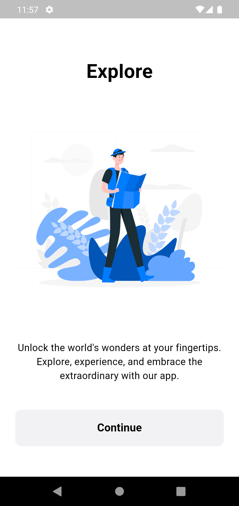
    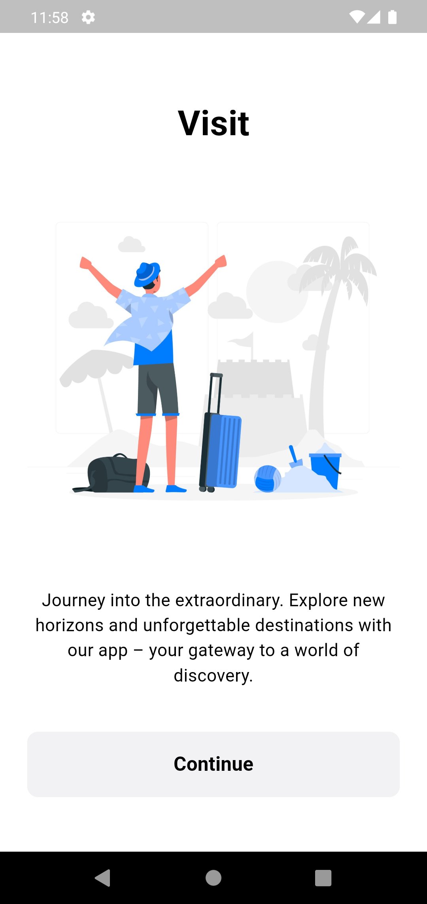
    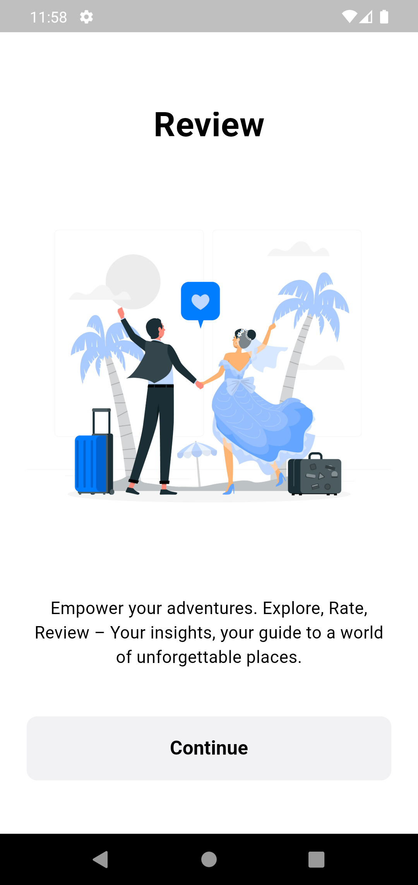
</div>
*Splash Pages displayed on app launch.*

### Login Page
<div style="display: flex; justify-content: space-around;">
    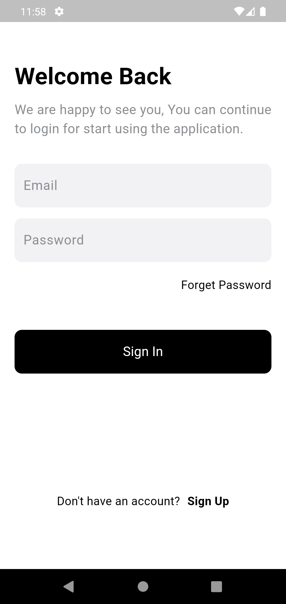
</div>
*Login Page for user authentication.*

### Signup Page
<div style="display: flex; justify-content: space-around;">
    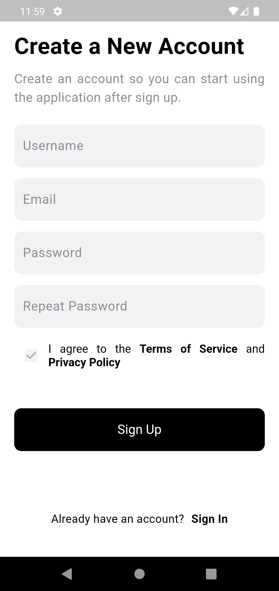
</div>
*Signup Page for new user registration.*

### Home Page
<div style="display: flex; justify-content: space-around;">
    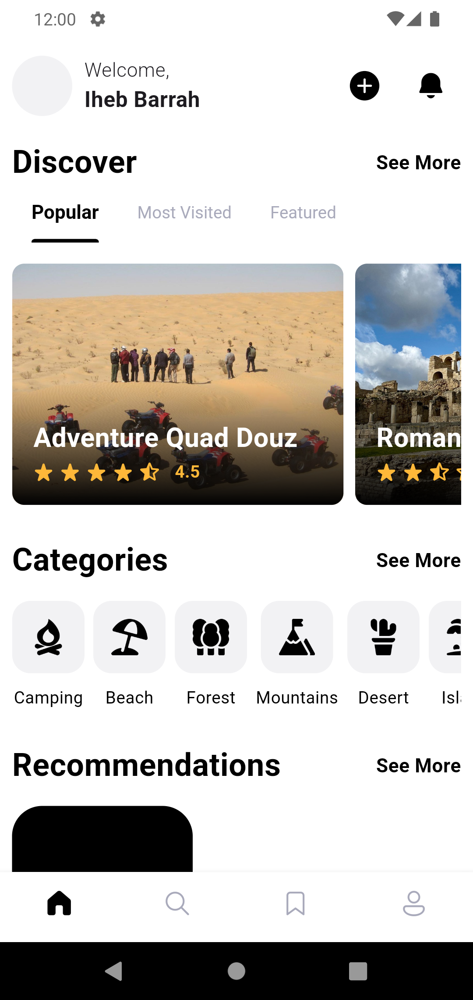
</div>
*Home Page showing featured places.*

### Search Page
<div style="display: flex; justify-content: space-around;">
    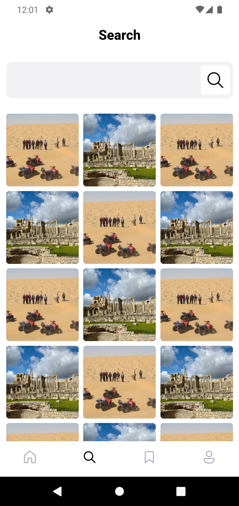
</div>
*Search Page for finding specific places.*

### Bookmark Page
<div style="display: flex; justify-content: space-around;">
    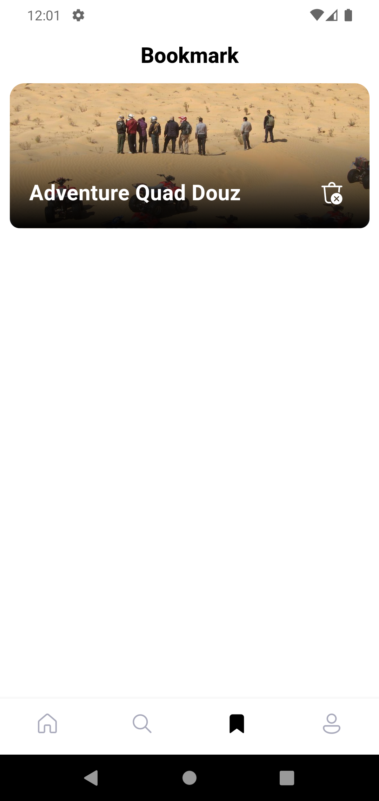
</div>
*Bookmark Page for saving favorite places.*

### Profile Page
<div style="display: flex; justify-content: space-around;">
    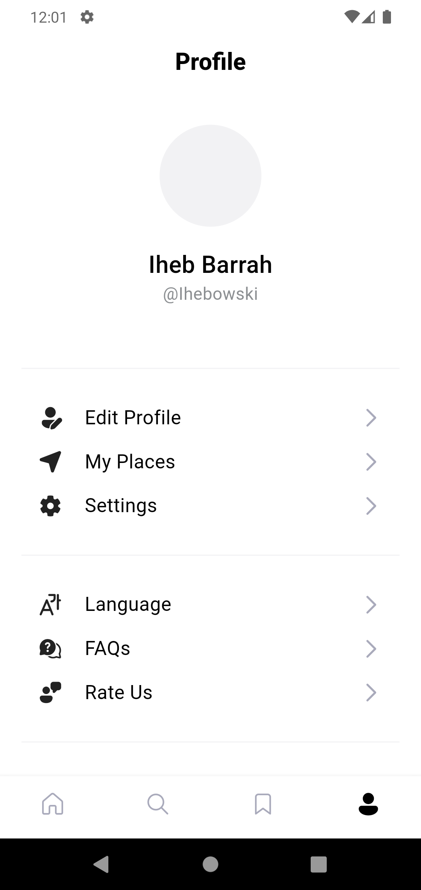
</div>
*Profile Page for user account management.*

### Category Page
<div style="display: flex; justify-content: space-around;">
    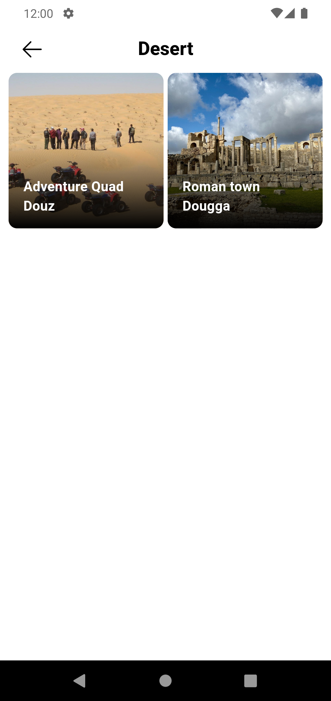
</div>
*Category Page for exploring different landscape types.*

### Notification Page
<div style="display: flex; justify-content: space-around;">
    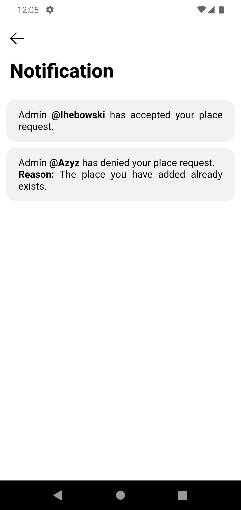
</div>
*Notification Page for user alerts and messages.*

### Add Place Page
<div style="display: flex; justify-content: space-around;">
    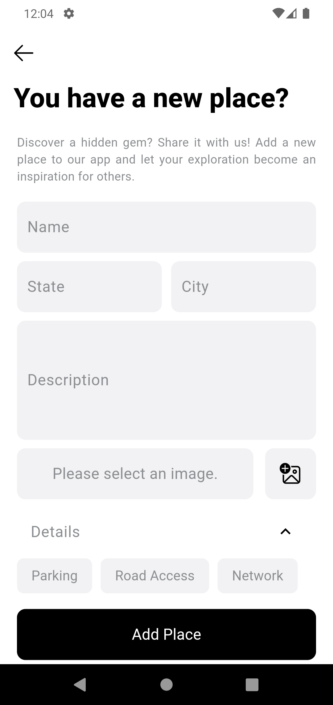
</div>
*Add New Place page where users can submit new locations.*

### Place Details
<div style="display: flex; justify-content: space-around;">
    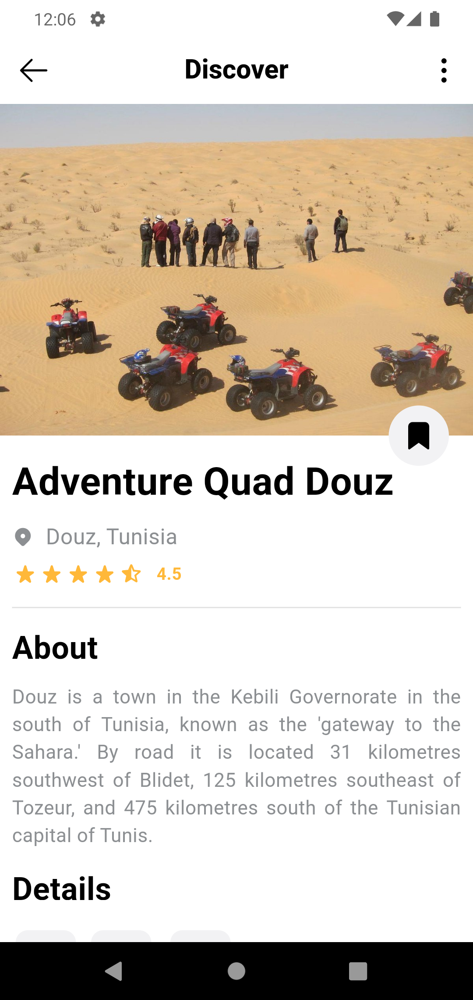
    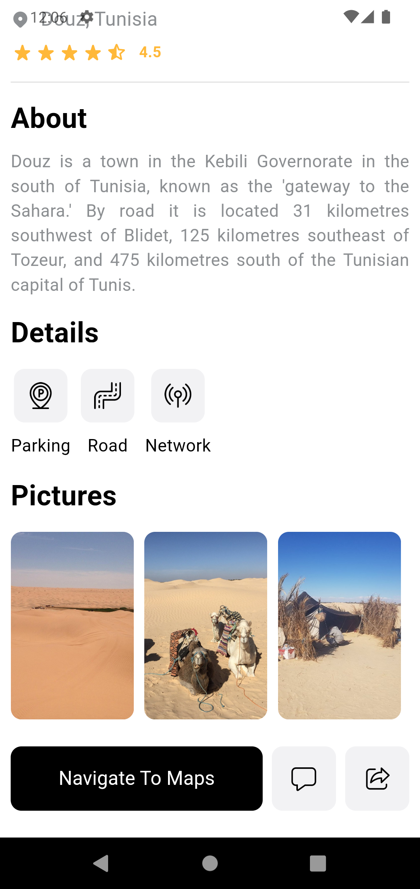
</div>
*Detailed views of a specific place.*

### Review Page
<div style="display: flex; justify-content: space-around;">
    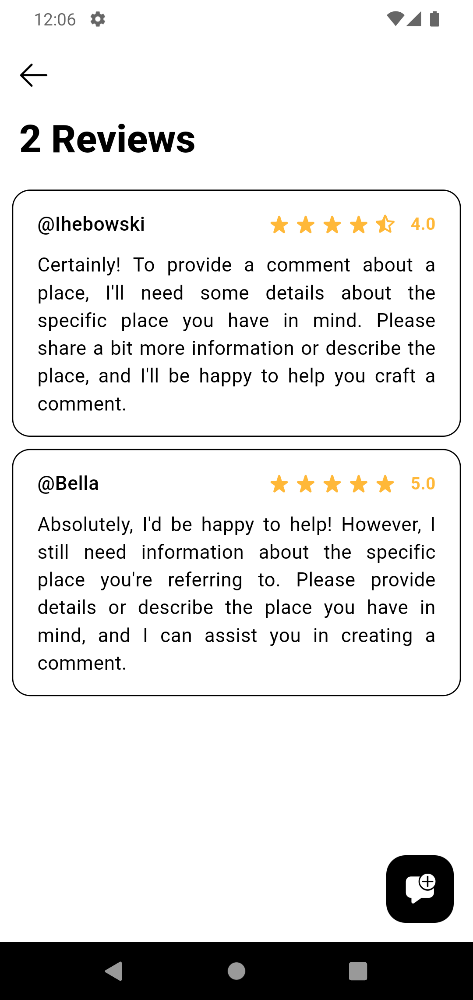
</div>
*Review Page for viewing user feedback on places.*

### Add Review Page
<div style="display: flex; justify-content: space-around;">
    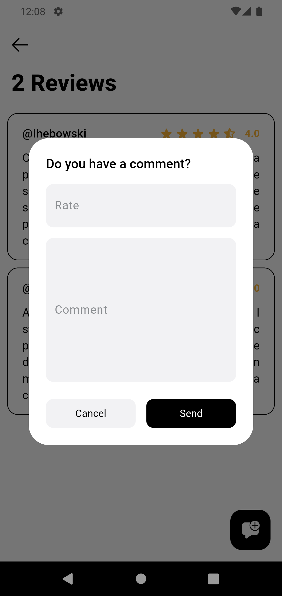
</div>
*Add Review page for users to leave feedback on places.*

## Tech Stack

- **Frontend Framework**: Flutter

## Installation

### Prerequisites

- Flutter installed on your machine. Follow the [Flutter installation guide](https://flutter.dev/docs/get-started/install) if not already installed.

### Steps

1. Clone the repository:

   ```bash
   git clone https://github.com/yourusername/ExploreEase.git
   ```

2. Navigate to the directory:

   ```bash
   cd ExploreEase
   ```

3. Install the dependencies:

   ```bash
   flutter pub get
   ```

4. Run the app:

   ```bash
   flutter run
   ```

   Ensure that you have a device or emulator running.

## Project Structure

```
lib/
 ├── models/         # Data models
 ├── views/          # UI screens
 ├── services/       # API calls and business logic
 └── main.dart       # Main entry point of the app
```

## Features Under Development

- **Search Functionality**: Ability to search for specific places by name or category.
- **User Profile**: View and edit user profile details.

## Contributions

Feel free to fork the repository, open an issue, or submit a pull request for any improvements or bug fixes.

## License

This project is licensed under the MIT License. See the [LICENSE](LICENSE) file for more information.